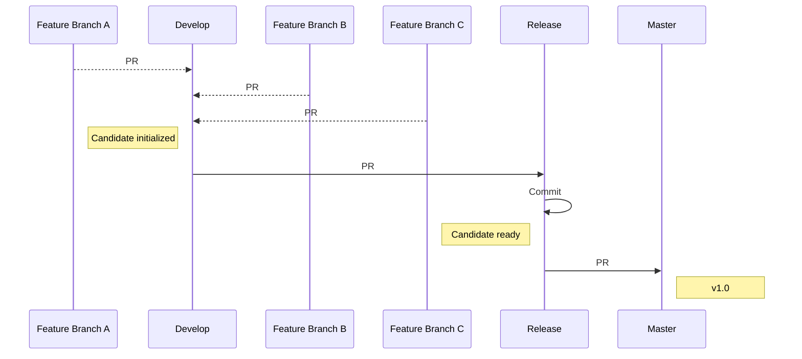

# Repositorio para el trabajo colaborativo 
El repositorio actual debe ser utilizando como código base sobre el cual simular 2 salidas a producción usando para ellos 4 equipos diferentes.

## Stats

## Contenido
* index.html
	* **landing page**
* generic.html
	* página genérica con contenido básico
* elements.html
	* página con código HTML fuente de diferentes elementos a añadir durante la generación de una web más compleja

## Equipos
### SEO
Encargado de añadir las metas en el primer lanzamiento y ayudar al equipo de contenidos para la página SEO del segundo lanzamiento
### MULTIMEDIA
Encargado de descargar y añadir al repositorio las imágenes a usar 
### FRONT
Encargado de añadir los elementos HTML a los ficheros para lograr los obtenidos establecidos
### CONTENIDOS
Encargado de generar los textos a ir añadiendo en ambos lanzamientos

## Lanzamientos
### v1.0
* Adaptar el contenido de la plantilla a los contenidos del taller
* El menú sólo tendrá la opción de HOME 
* La web tendrá dentro de los meta el término GIT
* Zona A/Banner → las imágenes y el texto estarán relacionados con el taller
* Zona B/Imagen+Texto → una entrada por equipo de trabajo con imagen relacionada y texto descriptivo
* Zona C/Texto sobre fondo → eliminar
* Zona D/Imágenes → logotipos o fotografías de la UCLM / GIT / Master / Escuela / Informática / HTML …
* Footer → incluir una referencia a la web de donde hemos obtenido la plantilla para seguir el término de la licencia: https://templated.co/license

### v2.0
* El menú tendrá la opción de HOME y SEO 
	* Index.html
		* Nueva zona entre las zonas B-D → añadir una lista con los 5 comandos más útiles de GIT vistos en el taller, con una pequeña descripción
		* Zona D/Imágenes → reemplazar las imágenes por el uso de imágenes y texto usando el estilo mostrado por “Left & Right” en elements
			* `
Texto
  `
			* `
Texto
 `
		* Footer → cambia el estilo para que el footer ocupe mucho menos espacio vertical. Enlaza el logo de twitter con el twitter del MUII
	* seo.html
		* Añade una web basada en generic.html con contenido relacionado con estrategias de SEO para mejorar el posicionamiento de la web, incluyendo una lista tipo check que indique las usadas en la web

## Gitflow
Usando el language de Markup, podemos dibujar diagramas  UML con [Mermaid](https://mermaidjs.github.io/). 

## Agradecimientos
* Victor Pérez Piqueras https://github.com/victorperezpiqueras
